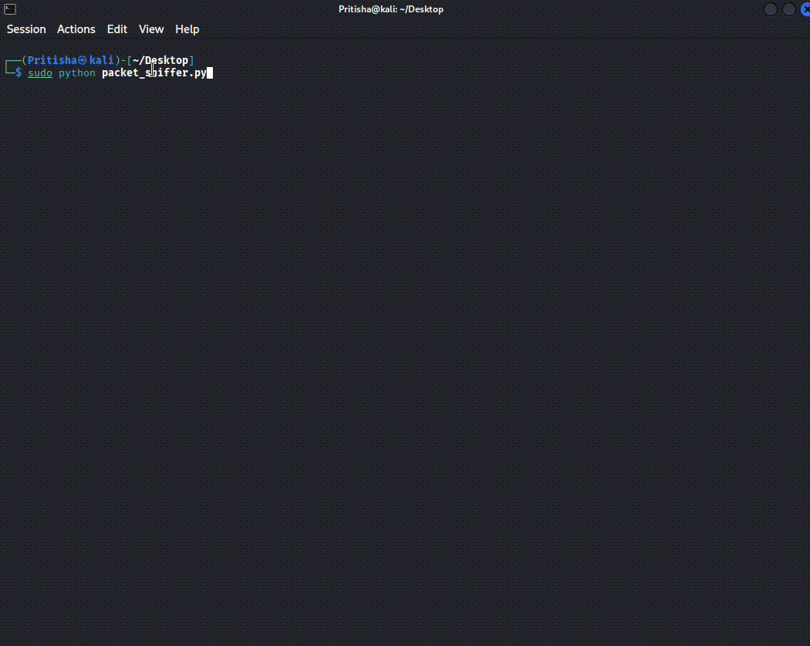

# 🕵️ Packet Sniffer

> A lightweight Python packet sniffer that captures and displays Ethernet frame information directly from the network interface.

<p align="center">
  
  
  
  
</p>

---

## 📌 About

This project is a simple **Ethernet packet sniffer written in Python**.

It uses a raw socket to capture network frames and extracts basic information from the Ethernet header, including:

- Destination MAC address
- Source MAC address
- Ethernet protocol

The project is designed to provide hands-on experience with **raw sockets, Ethernet frames, MAC addresses, binary packet structures, and low-level network communication**.

---

## 🔍 What Does It Do?

The sniffer continuously listens for Ethernet frames and processes the first **14 bytes** of each frame.

The Ethernet header is structured as:



```text
┌─────────────────────────────────────────────────┐
│ Destination MAC Address       6 bytes           │
├─────────────────────────────────────────────────┤
│ Source MAC Address            6 bytes           │
├─────────────────────────────────────────────────┤
│ EtherType / Protocol          2 bytes           │
├─────────────────────────────────────────────────┤
│ Payload                         Remaining data  │
└─────────────────────────────────────────────────┘