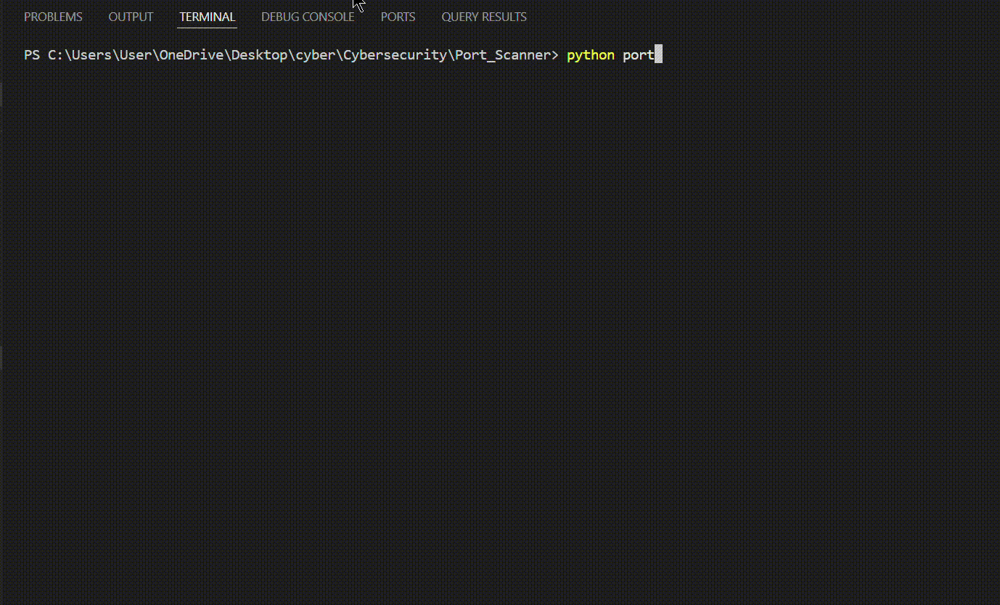

# 🔎 Python Port Scanner

> A lightweight multithreaded TCP port scanner built with Python's standard library for learning network reconnaissance, socket programming, and basic port discovery.

<p align="center">
  
  
  
  
</p>

---

## 📌 About

This project is a simple **TCP port scanner written in Python**.

It accepts a target hostname or IP address and a range of ports, then attempts to establish TCP connections to each port.

Open ports are reported directly in the terminal.

The scanner uses **Python threads** to perform multiple connection attempts concurrently, making it faster than checking every port sequentially.

---

## ⚡ Features

- 🎯 Scan a specific hostname or IP address
- 🔢 Scan a custom port range
- 🔌 TCP connection-based port detection
- 🧵 Multithreaded scanning
- ⏱️ Displays total scan duration
- 🌐 Resolves hostnames to IPv4 addresses
- 🎨 Color-coded terminal output
- 🚫 Uses only Python's standard library

---

## 🧠 How It Works



The scanner follows a simple workflow:

```text
             TARGET
                │
                ▼
       Resolve Hostname/IP
                │
                ▼
         Select Port Range
                │
                ▼
      Create Scanner Threads
                │
        ┌───────┼───────┐
        ▼       ▼       ▼
      Port    Port    Port
       80      443     22
        │       │       │
        ▼       ▼       ▼
     TCP Connection Attempts
                │
                ▼
       ┌─────────────────┐
       │ Port Open?      │
       └────────┬────────┘
                │
          Yes ──┴── No
           │         │
           ▼         ▼
        Display    Continue
         OPEN      Scanning